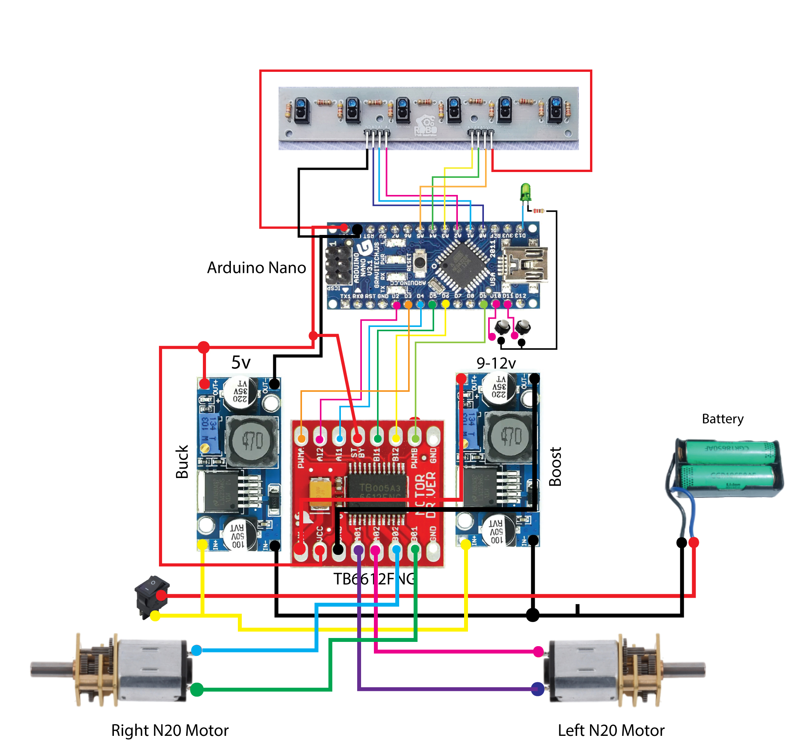

# Line-Follower-Robot (LFR)
### Circuit diagram:

### Balance charging orientation_Red wire must be faced downwards

<a href="Hardware/Charging tutorial with B6 for Li Ion & LiPo batteries.mp4" >Watch this video!</a>

<video src="Hardware/Charging tutorial with B6 for Li Ion & LiPo batteries.mp4" />

