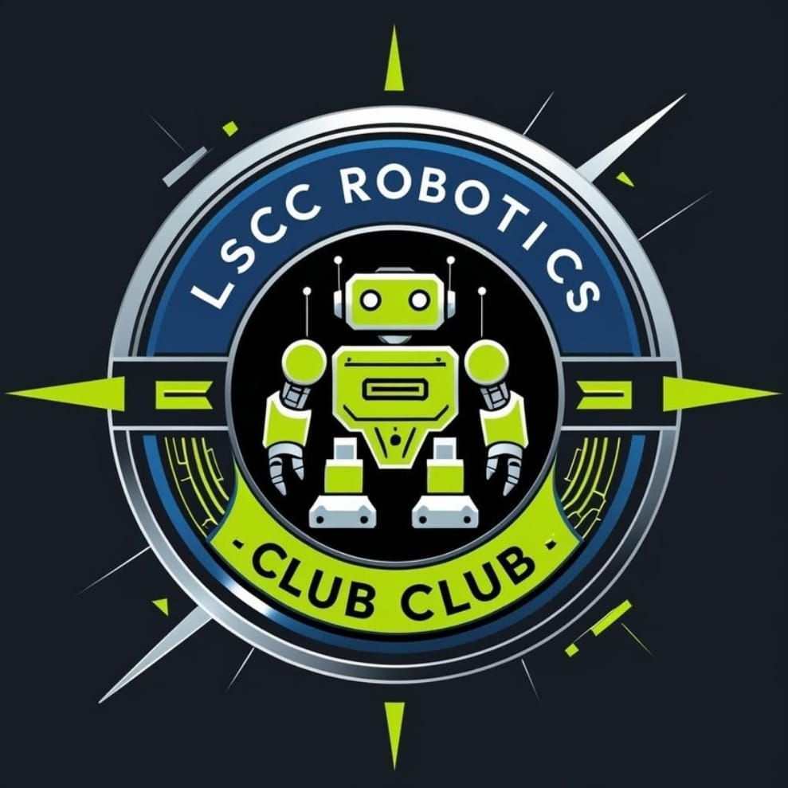
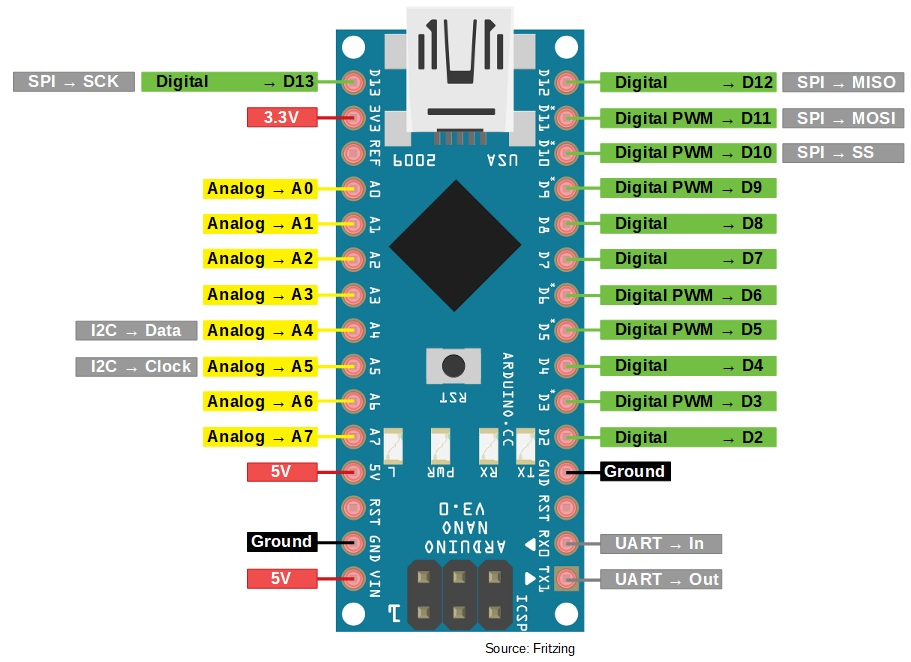
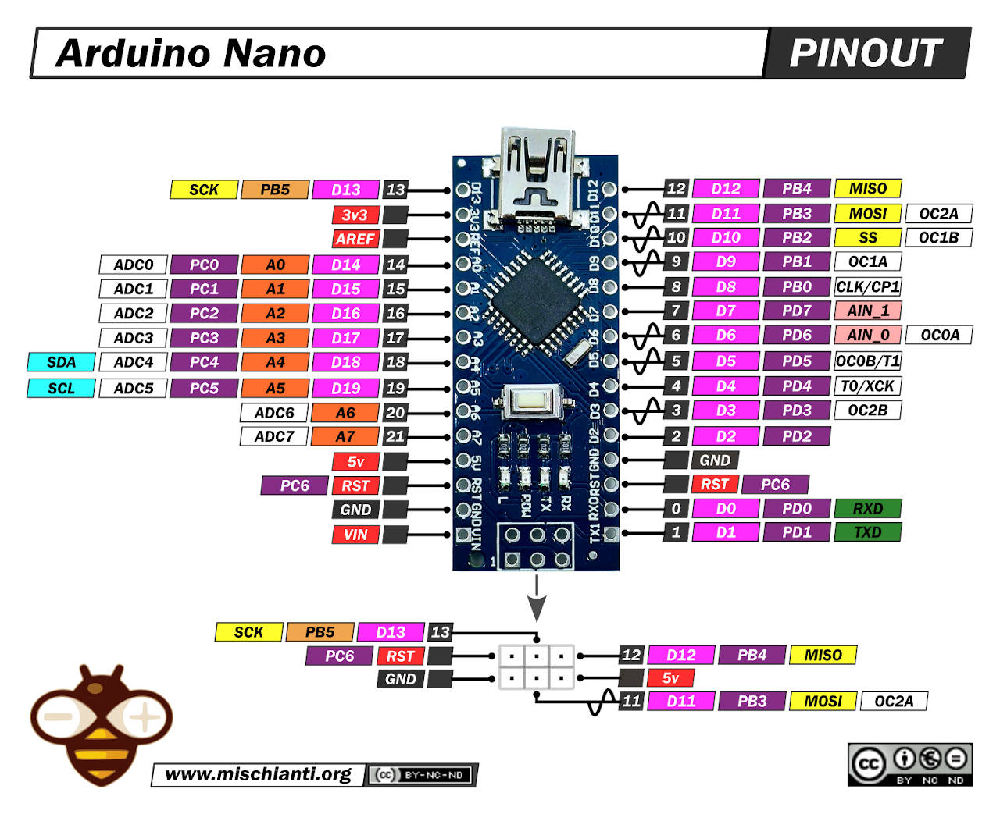
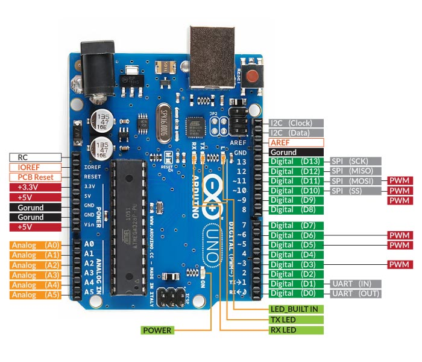
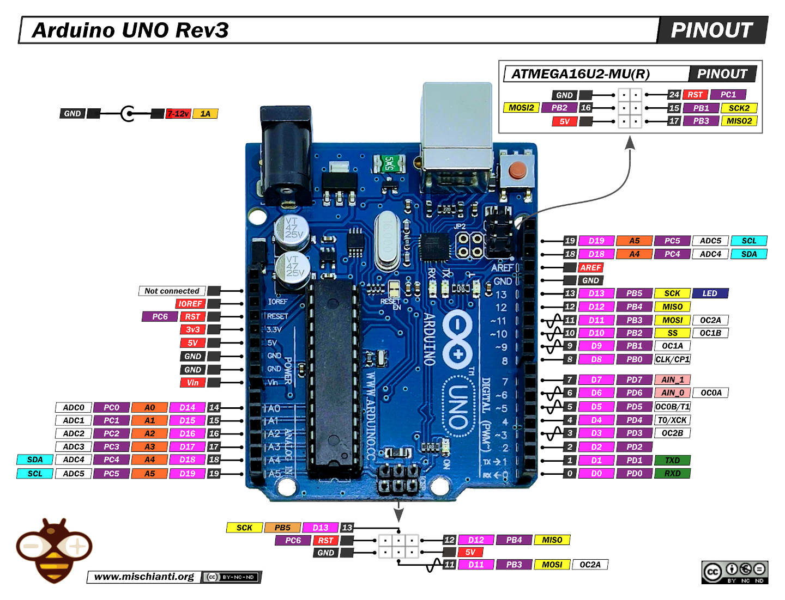

# RoboticsClub

### Author: Rakib Hasan, Lecturer(Physics), Leaders' School & College Chattogram.

## Tutorials
 ### Programming Tutorial:
 - ['C' Programming pdf book](<Computer Programming (C) 1st part by Tamim Shahriar Subeen.pdf>)
 - Alternative link: ['C' Programming pdf book](Computer%20Programming%20(C)%201st%20part%20by%20Tamim%20Shahriar%20Subeen.pdf)
 ### Arduino Tutorial:
 - [A Brief Introduction To Arduino](https://www.youtube.com/watch?v=nL34zDTPkcs)
 - [First program in Arduino Nano](https://www.youtube.com/watch?v=R102xfcx75I)
 - [Fundamentals: Currents, Voltage, Power & How to power your robots](https://www.youtube.com/watch?v=Iye4uVLmj8o&list=PLmZMSmNrIbn2F906Ibh4Jy4HtgfKOOqHC&index=5)
 - [LiPo Batteries: CAUTION!!!](https://youtu.be/Iye4uVLmj8o?list=PLmZMSmNrIbn2F906Ibh4Jy4HtgfKOOqHC&t=590)
 - [LiPo Guide for RC Beginners!](https://www.youtube.com/watch?v=Lk7wzVYmXSA&list=PLmZMSmNrIbn2F906Ibh4Jy4HtgfKOOqHC&index=5&t=262s)
 - [MY PLAYLIST](https://youtube.com/playlist?list=PLmZMSmNrIbn2F906Ibh4Jy4HtgfKOOqHC&si=s0Xlpj7HS1_l4KLY)

## Some useful projects and libraries are shared here:
 - Library:
     - [BitMap code generator](https://marlinfw.org/tools/u8glib/converter.html)
     - Servo library 
 - Projects:
     - [Sonar sensor activated load](Arduino/sonar_with_display)
     - Robo Soccer Bot
        - RC Controller Android App
        - ESP32 source code
        - Circuit diagram
     - LSCC LFR
        - Charging Tutorial with B6 charger for LiIon & LiPo batteries(2S, 3S)
        - Source codes
        - Tutorial: 
     - Bluetooth RC Controller Android App
     - AutoBin
     - [Water Dispenser](Projects/ScienceFair25/Sonar_Sensor_HC-SR04)

## Pinouts:
 - [Article: Arduino pinout](https://components101.com/microcontrollers/arduino-uno)
 - 
 - 
 - 
 - 
 - 
 - 
